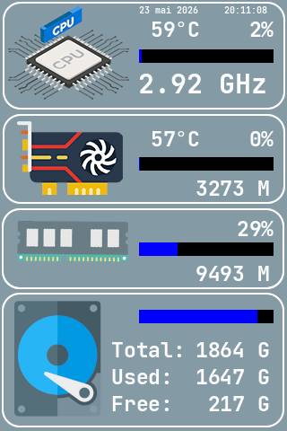
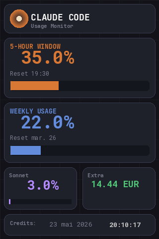

#  turing-smart-screen-python (fork with Claude Code usage monitor)

> [!NOTE]
> 
> This is a **fork** of [mathoudebine/turing-smart-screen-python](https://github.com/mathoudebine/turing-smart-screen-python) with added features:
> - **Claude Code usage monitor** theme displaying real-time API consumption (5h window, weekly, Sonnet, extra credits)
> - **Multi-screen manager** to switch between views with configurable keyboard shortcuts

> [!WARNING]
> 
> This project is **not affiliated, associated, authorized, endorsed by, or in any way officially connected with Turing / XuanFang / Kipye brands**, or any of theirs subsidiaries, affiliates, manufacturers or sellers of their products. All product and company names are the registered trademarks of their original owners.
> 
> This project is an open-source alternative software, NOT the original software provided for the smart screens. **Please do not open issues for USBMonitor.exe/ExtendScreen.exe or for the smart screens hardware here**.
> * for Turing Smart Screen, use the official forum here: http://discuz.turzx.com/
> * for other smart screens, contact your reseller

  [-000000?style=for-the-badge&logo=apple&logoColor=white)](https://github.com/mathoudebine/turing-smart-screen-python/issues/7)   [](./LICENSE)
  
A Python system monitor program and an abstraction library for **small IPS USB-C displays.**    

Supported operating systems : macOS, Windows, Linux (incl. Raspberry Pi), basically all OS that support Python 3.9+  

### ✅ Supported smart screens models:

| ✅ Turing Smart Screen / TURZX                                                                                                                                                                                                                                                                                                                                                                  |
|------------------------------------------------------------------------------------------------------------------------------------------------------------------------------------------------------------------------------------------------------------------------------------------------------------------------------------------------------------------------------------------------|
|    <br/>    |
| All available sizes and hardware revisions supported: **2.1" / 2.8" / 3.5" / 4.6" / 5" / 5.2" / 8.0" / 8.8" / 9.2" / 12.3"** <br/>UART and USB protocols supported. Note: no video or storage support for now                                                                                                                                                                                  |

| ✅ XuanFang 3.5"                                   | ✅ [UsbPCMonitor 3.5" / 5"](https://aliexpress.com/item/1005003931363455.html)                       | ✅ Kipye Qiye Smart Display 3.5"                                                  |
|---------------------------------------------------|-----------------------------------------------------------------------------------------------------|----------------------------------------------------------------------------------|
|                |                               |                 |
| revision B & flagship (with backplate & RGB LEDs) | Unknown manufacturer, visually similar to Turing 3.5" / 5". Original software is `UsbPCMonitor.exe` | Front panel has an engraved inscription "奇叶智显" Qiye Zhixian (Qiye Smart Display) |

| ✅ WeAct Studio Display FS V1 0.96"                            | ✅ WeAct Studio Display FS V1 3.5"                            |
|---------------------------------------------------------------|--------------------------------------------------------------|
|  |  |

<details>

<summary><h3>❌ Not (yet) supported / not tested smart screen models</h3></summary>

| ❔ _AIDA64 / AX206 / USB2LCD..._                                                                                                                                                                        | ❔ _[ACEMAGIC S1 Mini PC - integrated 1,9″ display](https://acemagic.com/products/acemagic-s1-12th-alder-laker-n95-mini-pc)_                                  |
|--------------------------------------------------------------------------------------------------------------------------------------------------------------------------------------------------------|--------------------------------------------------------------------------------------------------------------------------------------------------------------|
|   <br/>  |                                                                                                                    |
| Not supported for now. Produced by multiple manufacturers, all use the same [Appotech AX206 hacked photo frame firmware](https://github.com/dreamlayers/dpf-ax). Supported by AIDA64 and lcd4linux     | Not supported for now but could be integrated: protocol has been decoded, [see here](https://github.com/mathoudebine/turing-smart-screen-python/issues/677). |

| ❔ _NXElec BeadaPanel 3/4/5/6/7_                                                                                                                                                                                                                                                                                           |
|---------------------------------------------------------------------------------------------------------------------------------------------------------------------------------------------------------------------------------------------------------------------------------------------------------------------------|
|                                                                                                                          |
| Not supported for now but could be integrated: [Pankel-Link V1.0 Protocol Specification](https://www.nxelec.com/documents/bp/Panel-Link_USB_Media_Stream_Transport_Protocol_Rev10.pdf) / [Status-Link V1.1 Protocol Specification](https://www.nxelec.com/documents/bp/Status-Link_USB_Panel_Control_Protocol_Rev11.pdf). |

| ❌ _Waveshare [2.1inch](https://www.waveshare.com/wiki/2.1inch-USB-Monitor) / [2.8inch](https://www.waveshare.com/wiki/2.8inch-USB-Monitor) / [5inch](https://www.waveshare.com/wiki/5inch-USB-Monitor) / [7inch](https://www.waveshare.com/wiki/7inch-USB-Monitor) USB-Monitor_                                                                                                            | ❌ _[GUITION Smart screen 3.5"](https://aliexpress.com/item/1005006169962183.html)_                                                                                                                                                                                                          |
|--------------------------------------------------------------------------------------------------------------------------------------------------------------------------------------------------------------------------------------------------------------------------------------------------------------------------------------------------------------------------------------------|---------------------------------------------------------------------------------------------------------------------------------------------------------------------------------------------------------------------------------------------------------------------------------------------|
|                                                                                                                                                                                                                                                                                                                                           |                                                                                                                                                                                                                                                           |
| Sold on [Waveshare shop](https://www.waveshare.com/2.8inch-usb-monitor.htm) or [Aliexpress](https://fr.aliexpress.com/item/1005006071685067.html). Managed by [proprietary Windows software "Waveshare PC Monitor"](https://github.com/mathoudebine/turing-smart-screen-python/wiki/Vendor-apps#waveshare-pc-monitor---vendor-app). Cannot be supported by this project: needs a firmware. | Managed by [proprietary Windows software "GUITION Smart screen"](https://github.com/mathoudebine/turing-smart-screen-python/wiki/Vendor-apps#guition---vendor-app). Cannot be supported by this project: [see here](https://github.com/mathoudebine/turing-smart-screen-python/issues/426). |

| ❌ _[(Fuldho?) 3.5" IPS Screen](https://aliexpress.com/item/1005005632018367.html)_                                                                                                                                                     |
|----------------------------------------------------------------------------------------------------------------------------------------------------------------------------------------------------------------------------------------|
|                                                                                                                                                                          |
| Managed by [proprietary Windows software `SmartMonitor.exe`](https://smartdisplay.lanzouo.com/b04jvavkb). Cannot be supported by this project: [see here](https://github.com/mathoudebine/turing-smart-screen-python/discussions/298). |

</details>

### [> What is my smart screen model?](https://github.com/mathoudebine/turing-smart-screen-python/wiki/Hardware-revisions)  

**Please note all listed smart screens are different products** designed and produced by different companies, despite having a similar appearance. Their communication protocol is also different.  
This project offers an abstraction layer to manage all of these products in a unified way, including some product-specific features like backplate RGB LEDs for available models!

If you haven't received your screen yet but want to start developing your theme now, you can use the [**"simulated LCD" mode!**](https://github.com/mathoudebine/turing-smart-screen-python/wiki/Simulated-display)

## Fork additions

### Claude Code usage theme

A dedicated theme (`ClaudeCode`) that displays your Claude Code plan consumption in real time on the smart screen. Switch between your usual system monitor and the Claude usage view with a keyboard shortcut.

 

*Left: System Monitor (default) | Right: Claude Code Usage*

#### Displayed metrics

| Metric | Source | Display |
|--------|--------|---------|
| **5-Hour Window** | `five_hour.utilization` | Large percentage + orange progress bar + reset time (e.g. `Reset 19:30`) |
| **Weekly Usage** | `seven_day.utilization` | Large percentage + blue progress bar + reset date (e.g. `Reset Tue 26`) |
| **Sonnet** | `seven_day_sonnet.utilization` | Percentage + purple progress bar |
| **Extra Credits** | `extra_usage.used_credits` | Spent amount in EUR (converted from cents) |
| **Date / Time** | System clock | Displayed at the bottom |

Data is fetched from the Claude API endpoint (`/api/oauth/usage`) using your local OAuth credentials (`~/.claude/.credentials.json`). A shared cache (`_ClaudeUsageCache`) ensures the API is called at most once every 30 seconds, regardless of how many sensors read from it.

#### Custom data sources

All Claude sensors are implemented in `library/sensors/sensors_custom.py` as standard `CustomDataSource` subclasses, fully compatible with the theme engine:

| Class | Type | Value |
|-------|------|-------|
| `ClaudeFiveHourUsage` | numeric + history | 5h utilization % (0-100) |
| `ClaudeFiveHourReset` | text only | Reset time (`Reset HH:MM`) |
| `ClaudeWeeklyUsage` | numeric + history | 7-day utilization % (0-100) |
| `ClaudeWeeklyReset` | text only | Reset date (`Reset Mon DD`) |
| `ClaudeSonnetUsage` | numeric | Sonnet 7-day utilization % |
| `ClaudeExtraUsage` | numeric | Extra credits spent (EUR) |

You can reuse these classes in any other theme by referencing them in `theme.yaml` under `STATS > CUSTOM`.

#### Credentials

The credentials path is resolved in this order:
1. `CLAUDE_CREDENTIALS` environment variable (if set)
2. `~/.claude/.credentials.json` (default)

This is important when running as a systemd service (where `~` resolves to `/root`). The provided `start.sh` auto-detects the first non-root user's home directory.

---

### Multi-screen manager

The multi-screen manager (`multiscreen.py`) replaces `main.py` as the main entry point. It manages an **array of screens** and lets you cycle through them with configurable keyboard shortcuts.

```bash
python3 multiscreen.py
```

```
[multiscreen] Turing Smart Screen - Multi-screen Manager
[multiscreen] 2 screen(s) configured:
  [0] System Monitor (theme: 3.5inchTheme2)
  [1] Claude Code Usage (theme: ClaudeCode)

[multiscreen] Keybindings:
  next: ctrl + shift + end
  prev: ctrl + shift + home

[multiscreen] CTRL+C to exit
[multiscreen] Started: System Monitor (PID 12345)
```

#### Configuration: `multiscreen.yaml`

All screens and keybindings are defined in a single YAML file. Nothing is hardcoded.

```yaml
# Add as many screens as you want
screens:
  - name: "System Monitor"
    theme: "3.5inchTheme2"

  - name: "Claude Code Usage"
    theme: "ClaudeCode"

  # - name: "My Custom Theme"
  #   theme: "MyThemeFolder"

# All keybindings are configurable
keybindings:
  next: "ctrl + shift + end"       # Next screen in the list
  prev: "ctrl + shift + home"      # Previous screen in the list
  # screen_0: "ctrl + shift + f1"  # Jump directly to screen index 0
  # screen_1: "ctrl + shift + f2"  # Jump directly to screen index 1
```

#### Keybinding reference

| Action | Description |
|--------|-------------|
| `next` | Switch to the next screen (wraps around) |
| `prev` | Switch to the previous screen (wraps around) |
| `screen_N` | Jump directly to screen at index N (0-based) |

**Available keys for combos:**

| Category | Keys |
|----------|------|
| Modifiers | `ctrl`, `shift`, `alt` |
| Navigation | `home`, `end`, `page_up`, `page_down`, `up`, `down`, `left`, `right` |
| Function | `f1` - `f12` |
| Special | `space`, `tab`, `enter`, `esc`, `insert`, `delete` |
| Characters | Any single character (`a`, `b`, `1`, `2`, etc.) |

Combos are written with `+` separators: `"ctrl + shift + f1"`, `"alt + home"`, etc.

#### How it works

When you press a hotkey, the manager:
1. Sends `SIGTERM` to the currently running `main.py` process
2. Updates the `THEME` value in `config.yaml` (preserving comments)
3. Launches a new `main.py` process with the new theme

The switch takes about 1-2 seconds. If the monitor process crashes, the manager auto-restarts it.

---

### Running at boot (systemd)

A `start.sh` script is provided that handles venv activation, serial port permissions, and credential path detection.

#### Service file

```ini
# /etc/systemd/system/turing-smart-screen.service
[Unit]
Description=Turing Smart Screen - Multi-screen Manager
After=network.target graphical.target
Wants=graphical.target

[Service]
Type=simple
WorkingDirectory=/path/to/smart-screen-python-claude
ExecStart=/bin/bash /path/to/smart-screen-python-claude/start.sh
Restart=always
User=root
Group=root
Environment="PYTHONUNBUFFERED=1"
Environment="DISPLAY=:1"
Environment="XAUTHORITY=/run/user/1000/gdm/Xauthority"

[Install]
WantedBy=multi-user.target
```

> **Important:** The `DISPLAY` and `XAUTHORITY` environment variables are required for `pynput` to capture keyboard shortcuts from within a systemd service. Adjust the `DISPLAY` value (`:0`, `:1`, etc.) and `XAUTHORITY` path to match your system (`echo $DISPLAY` and `echo $XAUTHORITY` in a terminal).

#### Commands

```bash
sudo systemctl daemon-reload
sudo systemctl enable turing-smart-screen.service   # start at boot
sudo systemctl start turing-smart-screen.service     # start now
sudo systemctl status turing-smart-screen.service    # check status
journalctl -u turing-smart-screen.service -f         # follow logs
```

---

### Additional dependencies

On top of the base project requirements:

```bash
pip install pynput requests
```

---

### Files changed from upstream

| File | Change |
|------|--------|
| `library/sensors/sensors_custom.py` | Added 6 Claude usage sensor classes + shared API cache |
| `res/themes/ClaudeCode/` | New theme (background image + `theme.yaml`) |
| `multiscreen.py` | New multi-screen manager with hotkey support |
| `multiscreen.yaml` | New configurable screens array and keybindings |
| `start.sh` | New launcher script for systemd with credential detection |
| `generate_background.py` | Script to regenerate the Claude theme background |
| `config.yaml` | `DISPLAY_REVERSE: true` (hardware-specific) |

---

## How to start

### [> Follow instructions on the wiki to configure and start this project.](https://github.com/mathoudebine/turing-smart-screen-python/wiki)

There are 2 possible uses of this project Python code:
* **[as a System Monitor](#system-monitor)**, a standalone program working with themes to display your computer HW info and custom data in an elegant way.
[Check if your hardware is supported.](https://github.com/mathoudebine/turing-smart-screen-python/wiki/System-monitor-:-hardware-support)
* **[integrated in your project](#control-the-display-from-your-python-projects)**, to fully control the display from your own Python code.

## System monitor

This project is mainly a complete standalone program to use your screen as a system monitor, like the original vendor app.  
Some themes are already included for a quick start!  
### [> Configure and start system monitor](https://github.com/mathoudebine/turing-smart-screen-python/wiki/System-monitor-:-how-to-start)
  

* Fully functional multi-OS code base (operates out of the box, tested on Windows, Linux & MacOS).
* Display configuration using GUI configuration wizard or `config.yaml` file: no Python code to edit.
* Compatible with [multiple smart screen models (Turing, XuanFang...)](https://github.com/mathoudebine/turing-smart-screen-python/wiki/Hardware-revisions). Backplate RGB LEDs are also supported for available models!
* Support [multiple hardware sensors and metrics (CPU/GPU usage, temperatures, memory, disks, etc)](https://github.com/mathoudebine/turing-smart-screen-python/wiki/System-monitor-:-themes#stats-entry) with configurable refresh intervals.
* Allow [creation of themes (see `res/themes`) with `theme.yaml` files using theme editor](https://github.com/mathoudebine/turing-smart-screen-python/wiki/System-monitor-:-themes) to be [shared with the community!](https://github.com/mathoudebine/turing-smart-screen-python/discussions/categories/themes)
* Easy to expand: [custom Python data sources](https://github.com/mathoudebine/turing-smart-screen-python/wiki/System-monitor-:-themes#add-custom-stats-to-a-theme) can be written to pull specific information and display it on themes like any other sensor.
* Auto-detect COM port based on the selected smart screen model.
* Tray icon with Exit option, useful when the program is running in background.

### [> List and preview of included themes](res/themes/themes.md)
       ... [view full list](res/themes/themes.md)
### [> Themes creation/edition (using theme editor)](https://github.com/mathoudebine/turing-smart-screen-python/wiki/System-monitor-:-themes)
### [> Themes shared by the community](https://github.com/mathoudebine/turing-smart-screen-python/discussions/categories/themes)
 
  and more... Share yours!

## Control the display from your Python projects

If you don't want to use your screen for system monitoring, you can just use this project as a module from any Python code to do some simple operations on the display:
- **Display custom picture**
- **Display text**
- **Display horizontal / radial progress bar**
- **Screen rotation**
- Clear the screen (blank)
- Turn the screen on/off
- Display soft reset
- Set brightness
- Set backplate RGB LEDs color (on supported hardware rev.) 

This project will act as an abstraction library to handle specific protocols and capabilities of each supported smart screen models in a transparent way for the user.
Check `simple-program.py` as an example.

### [> Control the display from your code](https://github.com/mathoudebine/turing-smart-screen-python/wiki/Control-screen-from-your-own-code)

## Troubleshooting
If you have trouble running the program as described in the wiki, please check [open/closed issues](https://github.com/mathoudebine/turing-smart-screen-python/issues) & [the wiki Troubleshooting page](https://github.com/mathoudebine/turing-smart-screen-python/wiki/Troubleshooting)

## They're talking about it!

* [Hackaday - Cheap LCD Uses USB Serial](https://hackaday.com/2023/09/11/cheap-lcd-uses-usb-serial/)  


* [CNX Software - Turing Smart Screen – A low-cost 3.5-inch USB Type-C information display](https://www.cnx-software.com/2022/04/29/turing-smart-screen-a-low-cost-3-5-inch-usb-type-c-information-display/)


* [Phazer Tech - Turing Smart Screen Python ](https://phazertech.com/tutorials/turing-smart-screen.html)

## Star History

[](https://star-history.com/#mathoudebine/turing-smart-screen-python&Date)
